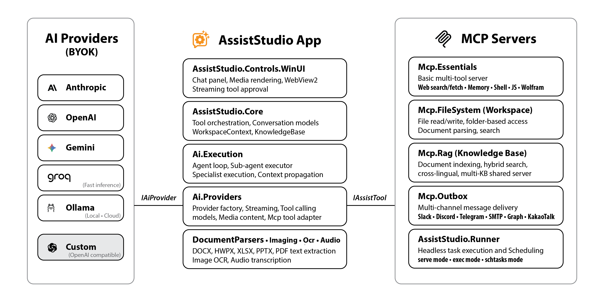

<p align="right">
  <strong>English</strong> · <a href="README.ko.md">한국어</a>
</p>

# FieldCure AssistStudio

<picture>
  <source srcset="docs/hero-en.webp" type="image/webp">
  
</picture>

**AI Chat Controls for WinUI 3 + Windows AI Workspace App — Bring Your Own Key, pick any provider.**

<a href="https://apps.microsoft.com/detail/9N09D0QGSTZD">
  
</a>

[](https://apps.microsoft.com/detail/9N09D0QGSTZD)
[](https://www.nuget.org/packages/FieldCure.Ai.Providers)
[](https://www.nuget.org/packages/FieldCure.AssistStudio.Core)
[](https://www.nuget.org/packages/FieldCure.AssistStudio.Controls.WinUI)
[](LICENSE)
[](https://dotnet.microsoft.com/)

> Adapter, runner, and MCP-server packages have their own badges in [Packages](#packages).

AssistStudio is two things:

1. **A reusable WinUI 3 library** for building desktop AI assistants with multi-provider support, tool approval, and profile-based behavior. Comes with optional adapter packages so you can stream from a vendor SDK (e.g. the official Anthropic SDK) directly into the chat UI when you want its latest features without reimplementing `IAiProvider`.
2. **A Windows-native AI workspace app** for cloud and local models, profiles, tools, and structured conversations.


## Contents

- [Features](#features)
- [Architecture](#architecture)
- [Quick Start](#quick-start)
- [Providers](#providers)
- [Controls](#controls)
- [MCP Integration](#mcp-integration)
- [Configuration](#configuration)
- [Requirements](#requirements)
- [Packages](#packages)

### Architecture Overview



---

## Features

### Providers & Streaming
- **BYOK (Bring Your Own Key)** — Users supply their own API keys. No proxy, no middleman.
- **Multi-Provider** — Claude, OpenAI, Gemini, Ollama, Groq, and any OpenAI-compatible endpoint out of the box. Implement `IAiProvider` to add your own.
- **Streaming** — Real-time structured event streaming via `IAsyncEnumerable<StreamEvent>` with elapsed time display.
- **Extended Thinking** — Per-provider thinking/reasoning support (Claude, OpenAI o-series, Ollama native thinking). Configurable via `ThinkingOverride` and `ThinkingBudget`.
- **Token Tracking** — Input/output token counts exposed after every request.

### Tools & Agents
- **Tool / Function Calling** — Define tools with `IAssistTool`. `ToolCallExecutor` orchestrates execution with confirmation flow and parallel execution.
- **MCP Integration** — Connect to MCP servers (Stdio / HTTP) to aggregate tools. `McpToolAdapter` bridges MCP tools to `IAssistTool`.
- **Built-in MCP Servers** — Essentials (12–16 tools), Filesystem, Knowledge Base (RAG), Outbox, and Runner — fetched and run directly from NuGet via `dnx` (.NET 10 SDK), pinned to a major-version range so minor/patch updates flow through on the next launch.
- **Sub-Agent Delegation** — `delegate_task` for autonomous sub-agent execution. Parallel dispatch (multiple `delegate_task` blocks in a single model turn run concurrently and each renders a pulsing placeholder that resolves in place), specialist routing (`ISpecialist` — Web Search, Judgment), and truncation-aware result handling (sub-agent `max_tokens` cutoff is propagated as `status: "truncated"` so the parent never forwards a mid-markdown stub as final).

### UI & Media
- **Re-templatable WinUI 3 Controls** — `ChatPanel`, `ComposeBar`, `AttachmentPreviewBar`, `ToolApprovalPanel` — all `TemplatedControl`s with `Generic.xaml` override.
- **Conversation Branching** — Tree-based message editing with branch navigator (◀ 1/2 ▶). Edit any message to explore alternatives without losing history.
- **Vision & Documents** — Attach images, PDFs, DOCX, HWPX, XLSX, PPTX. Automatic image compression. Per-provider `PdfCapability`.
- **Multimedia Tool Results** — MCP image, audio, and video content rendered inline. Image hover toolbar with zoom, save, and copy.
- **Localization** — Built-in en-US and ko-KR resource strings.

### Data & Persistence
- **Conversation Persistence** — Save and load conversations in `.astx` (ZIP archive) format with full branching tree and media persistence.
- **Profiles & Presets** — Save provider configurations as presets; switch system prompts and tool selections with profiles.
- **Knowledge Base** — Multi-KB management with embedding model selection and per-conversation KB selector.
- **Schedule** — Cron schedule management with bilingual (en/ko) human-readable descriptions.
- **Workspace Context** — `IWorkspaceContext` for dynamic system prompt injection based on app state.
- **Structured Logging** — `DiagnosticLogger` with pluggable `OnException`, `OnWarning`, `OnInfo` callbacks.

---

## Screenshots

<table>
  <tr>
    <th align="center">Empty State</th>
    <th align="center">Tool Approval</th>
  </tr>
  <tr>
    <td align="center"></td>
    <td align="center"></td>
  </tr>
</table>

---

## Architecture

| Project | NuGet Package | TFM | Key Types |
|---------|--------------|-----|-----------|
| **Ai.Providers** | `FieldCure.Ai.Providers` | `net8.0` | `IAiProvider`, `StreamEvent`, `IAssistTool`, `AiRequest`, `AiResponse`, `ChatMessage`, `ProviderModel`, `CustomProviderConfig`, `McpToolAdapter`, `ImageCompressor`, `IMultiContentTool`, `MediaContent` |
| **Ai.Execution** | `FieldCure.Ai.Execution` | `net8.0` | `IAgentLoop`, `AgentLoop`, `ISubAgentExecutor`, `SubAgentExecutor`, `AgentLoopContext`, `AgentLoopResult` |
| **AssistStudio.Core** | `FieldCure.AssistStudio.Core` | `net8.0` | `ISpecialist`, `KnowledgeBase`, `ToolCallExecutor`, `ToolResolver`, `IWorkspaceContext`, `BuiltInServerConfig`, `Profile` |
| **AssistStudio.Controls** | `FieldCure.AssistStudio.Controls.WinUI` | `net8.0-windows10.0.19041.0`<br>`net9.0-windows10.0.19041.0` | `ChatPanel`, `ComposeBar`, `AttachmentPreviewBar`, `ToolApprovalPanel`, `ToolElicitationPanel`, `ChatTheme` |
| **AssistStudio.Anthropic** *(optional adapter)* | `FieldCure.AssistStudio.Anthropic` | `net8.0`<br>`net9.0` | `AnthropicStreamEventMapper`, `AnthropicMessageConverter` — maps the official `Anthropic` SDK's `RawMessageStreamEvent` to `StreamEvent` |
| **AssistStudio.Controls.Anthropic** *(optional adapter)* | `FieldCure.AssistStudio.Controls.WinUI.Anthropic` | `net8.0-windows10.0.19041.0`<br>`net9.0-windows10.0.19041.0` | `ChatPanelExtensions` — one-call streaming of an Anthropic SDK response into a `ChatPanel` via `AssistantTurnHandle` |
| **AssistStudio** | *(workspace app)* | `net9.0-windows10.0.19041.0` | Reference implementation with settings, MCP server management, sub-agent delegation, schedule, and `PasswordVaultHelper` |

> **Core is platform-agnostic** (`net8.0`). It has no Windows-specific dependencies — you can reference it from a console app, a server, or any .NET project.

See [Dependency Graph](docs/dependencies.md) for the full cross-repository package dependency map.

**Choose your path:**
- **Building with the libraries** — start with [Quick Start](#quick-start) below; the [Controls package README](src/AssistStudio.Controls/README.md) covers ChatPanel template parts and the full property reference.
- **Running the workspace app** — install from the [Microsoft Store](https://apps.microsoft.com/detail/9N09D0QGSTZD), or clone this repo and `dotnet run --project src/AssistStudio`.

---

## Quick Start

### 1. Install packages

```bash
dotnet add package FieldCure.AssistStudio.Core
dotnet add package FieldCure.AssistStudio.Controls.WinUI
```

### 2. Create a provider and wire up the control

```csharp
using FieldCure.Ai.Providers;

// Pick a provider — API key comes from the user
var provider = new ClaudeProvider(apiKey: "sk-ant-...", modelId: "claude-sonnet-4-6");
```

```xml
<!-- In your WinUI 3 Page -->
<Page xmlns:assist="using:FieldCure.AssistStudio.Controls">

    <assist:ChatPanel x:Name="Chat"
                      Placeholder="Ask anything..."
                      Theme="System" />
</Page>
```

```csharp
// Code-behind
Chat.Provider = provider;
```

That's it — you have a fully functional AI chat with streaming, Markdown rendering, syntax highlighting, thinking blocks, and conversation branching.

### 3. Streaming with StreamEvent

```csharp
var request = new AiRequest("Explain quantum computing.");

await foreach (var evt in provider.StreamAsync(request))
{
    switch (evt)
    {
        case StreamEvent.ThinkingDelta t:
            Console.Write($"[think] {t.Text}");
            break;
        case StreamEvent.TextDelta d:
            Console.Write(d.Text);
            break;
        case StreamEvent.ToolCallStart s:
            Console.WriteLine($"\n→ Calling {s.FunctionName}...");
            break;
        case StreamEvent.Usage u:
            Console.WriteLine($"\nTokens: {u.TokenUsage.TotalTokens}");
            break;
    }
}
```

---

## Providers

### Supported providers

| Provider | Streaming | Vision | Documents | Tool Calling | Thinking | API Key Required |
|----------|:---------:|:------:|:---------:|:------------:|:--------:|:----------------:|
| **Claude** (Anthropic) | Yes | Yes | Yes | Yes | Yes | Yes |
| **OpenAI** (+ compatible) | Yes | Yes | Yes | Yes | o-series | Yes |
| **Gemini** (Google) | Yes | Yes | Yes | Yes | No | Yes |
| **Ollama** (local) | Yes | Dep. | Dep. | Dep. | think tags | No |
| **Groq** | Yes | Yes | Yes | Yes | Dep. | Yes |
| **Custom** (OpenAI-compatible) | Yes | Dep. | Dep. | Dep. | think tags | Dep. |

> Register any OpenAI-compatible endpoint via `ProviderFactory.RegisterCustomProvider` with a `CustomProviderConfig` (BaseUrl, DisplayName).

### Implementing a custom provider

Implement `IAiProvider` to integrate any AI service. The interface boils down to:

```csharp
public interface IAiProvider
{
    string ProviderName { get; }
    string ModelId { get; }
    PdfCapability PdfCapability { get; }
    TokenUsage? LastUsage { get; }

    Task<AiResponse> CompleteAsync(AiRequest request, CancellationToken ct = default);
    IAsyncEnumerable<StreamEvent> StreamAsync(AiRequest request, CancellationToken ct = default);
    Task<IReadOnlyList<AiModel>> ListModelsAsync(CancellationToken ct = default);
    Task<ConnectionInfo> ValidateConnectionAsync(CancellationToken ct = default);
    ThinkingSupport GetThinkingSupport(string modelId);
}
```

Assign your implementation to a `ChatPanel`:

```csharp
Chat.Provider = new MyCustomProvider();
```

See [docs/CustomProvider.md](docs/CustomProvider.md) for a complete walkthrough — full skeleton, streaming, tool calling, and how to register it with `ProviderFactory`.

### Third-party SDK adapters

When you'd rather stream from an official vendor SDK instead of using a built-in `IAiProvider` implementation, the adapter packages bridge that SDK's event stream into `ChatPanel` without you having to write an `IAiProvider`.

**Anthropic SDK** — `FieldCure.AssistStudio.Anthropic` (platform-agnostic, for any .NET host) and `FieldCure.AssistStudio.Controls.WinUI.Anthropic` (ChatPanel extensions):

```csharp
using Anthropic;
using FieldCure.AssistStudio.Controls.Anthropic;

var client = new AnthropicClient();
var sdkStream = client.Messages.CreateStreaming(new MessageCreateParams
{
    Model = "claude-sonnet-4-6",
    MaxTokens = 4096,
    Messages = [/* … */],
});

// Begin an assistant turn, then consume the SDK stream through the mapper.
// RawMessageStreamEvent is translated to StreamEvent and rendered directly.
using var turn = Chat.BeginAnthropicTurn(providerName: "Claude", modelId: "claude-sonnet-4-6");
await turn.StreamAnthropicAsync(sdkStream);
```

Use the adapter when you need features the vendor SDK ships first (new beta capabilities, prompt caching controls, etc.) while keeping the `ChatPanel` UX — branching, attachments, tool approval — intact.

---

## Controls

All controls are **TemplatedControls** defined in `Generic.xaml`. They carry no app-level dependency — reference the NuGet package and use them in any WinUI 3 project.

### ChatPanel

The main control. Provides a complete chat experience: message list (WebView2), input area, streaming, thinking blocks, conversation branching, attachments, presets, and profiles.

```xml
<assist:ChatPanel Provider="{x:Bind ViewModel.Provider, Mode=OneWay}"
                  SystemPrompt="You are a helpful assistant."
                  Theme="Dark"
                  Placeholder="Type a message..."
                  AvailableModels="{x:Bind ViewModel.Models}"
                  SelectedModel="{x:Bind ViewModel.CurrentModel, Mode=TwoWay}"
                  RegisteredTools="{x:Bind ViewModel.Tools}"
                  WorkspaceContext="{x:Bind ViewModel.Workspace}" />
```

See the [Controls package README](src/AssistStudio.Controls/README.md) for the full dependency-property reference (provider/model, workspace, knowledge base, tools, behavior, theming) and the events list. The same content is published on the [NuGet package page](https://www.nuget.org/packages/FieldCure.AssistStudio.Controls.WinUI).

### ComposeBar

The chat input area — text box, attach button, model/profile selectors. Used internally by `ChatPanel`, but can be placed standalone.

### AttachmentPreviewBar

Horizontal scrollable bar showing thumbnails of attached files before sending.

### ToolApprovalPanel

Inline confirmation panel shown when a tool with `RequiresConfirmation = true` is invoked. Displays the tool name, an expandable JSON arguments preview, and Allow/Reject buttons. Replaces `ComposeBar` during confirmation and restores it after.

### ToolElicitationPanel

Inline input panel shown when an MCP server issues an `elicitation/create` request mid-tool-call (e.g. asking for a missing API key or confirming a destructive action). Renders the server-supplied JSON Schema as a native form — `string`, `number`, `boolean`, enum, and multi-field objects. String fields whose name looks secret (`password`, `secret`, `token`, `apiKey`, etc.) automatically render as `PasswordBox` to avoid leaking values via shoulder-surfing or screen capture. Server-origin badge and batch submit keep the flow auditable.

### Re-templating

Override the default template in your app's resources:

```xml
<Style TargetType="assist:ChatPanel" BasedOn="{StaticResource DefaultChatPanelStyle}">
    <!-- Customize template parts: PART_MessageList, PART_InputArea, PART_TitleBar, etc. -->
</Style>
```

---

## MCP Integration

The workspace app demonstrates full MCP (Model Context Protocol) integration:

- **McpServerRegistry** — Singleton server connection manager with observable tool collection
- **McpServerConnection** — Per-server lifecycle (Disconnected → Connecting → Connected / Error)
- **McpToolAdapter** — Bridges MCP tools to `IAssistTool` without Core SDK dependency
- **ToolResolver** — Merges built-in + MCP tools, prefixing MCP tool names with server name on conflict
- **SearchToolsTool** — Meta-tool for searching across large MCP tool sets to save tokens

MCP servers are configured with Stdio or HTTP transport and connected at app startup. Tools from all connected servers are aggregated and made available to providers.

### Built-in MCP Servers

The workspace app bundles a set of MCP servers (Essentials, Filesystem, Knowledge Base, Outbox, Runner) — see [Packages → MCP Servers](#mcp-servers) below for the full list with descriptions and badges.

**BuiltInServerHelper** launches each built-in server as `dnx <PackageId>@<Major>.* --yes …` at startup. `dnx` fetches and caches the latest in-range version directly from NuGet; AssistStudio polls NuGet on a 24-hour interval and surfaces an in-app notification when a new in-range build appears. Read-only tools (read, list, search) skip user approval.

#### Update model

No manual `dotnet tool update` step is needed. `dnx` resolves within the pinned major range on each invocation, so minor/patch releases flow through automatically on the next app launch. Major-version bumps (e.g. `2.* → 3.*`) are intentionally release-coupled to AssistStudio itself so breaking changes can be validated against the host before being picked up.

---

## Configuration

### Provider models

```csharp
var model = new ProviderModel
{
    Name = "Claude Sonnet",
    ProviderType = "Claude",
    ApiKey = "sk-ant-...",
    ModelId = "claude-sonnet-4-6",
    Temperature = 0.7,
    MaxTokens = 4096,
    StreamingEnabled = true,
    ThinkingEnabled = true,
    ThinkingBudget = 8192
};
```

### Profiles

Profiles pair a system prompt with optional provider/model preferences and tool selections:

```csharp
var profile = new Profile
{
    Name = "Task Planner",
    SystemPrompt = "You are a task planner that breaks down complex requests into steps.",
    EnabledServers = ["builtin_essentials", "builtin_filesystem"],
    UseSearchTools = true  // Use meta-tool instead of sending all tool definitions
};
```

---

## Requirements

| Dependency | Minimum Version | Scope |
|------------|----------------|-------|
| .NET runtime | 8.0 | Library consumers (Core / Controls / Providers / Execution) |
| .NET SDK | 10.0 | AssistStudio app — `dnx` (ships with the .NET 10 SDK) launches built-in MCP servers |
| Windows App SDK | 1.7 | AssistStudio app + Controls |
| WebView2 Runtime | Evergreen | AssistStudio app + Controls |
| Target Platform | Windows 10 1903+ (10.0.19041.0) | AssistStudio app + Controls |

---

## Packages

### MCP Servers

| Package | Version | Description |
|---------|---------|-------------|
| [FieldCure.Mcp.Essentials](https://github.com/fieldcure/fieldcure-mcp-essentials) | [](https://www.nuget.org/packages/FieldCure.Mcp.Essentials) | 12–16 tools — HTTP, web search (+ news/images/scholar/patents), web/document fetching, shell, JavaScript sandbox, environment info, file I/O, persistent memory |
| [FieldCure.Mcp.Outbox](https://github.com/fieldcure/fieldcure-mcp-outbox) | [](https://www.nuget.org/packages/FieldCure.Mcp.Outbox) | Multi-channel messaging — Slack, Discord, Telegram, Email (Gmail / Naver / SMTP / Microsoft Graph), KakaoTalk |
| [FieldCure.Mcp.Filesystem](https://github.com/fieldcure/fieldcure-mcp-filesystem) | [](https://www.nuget.org/packages/FieldCure.Mcp.Filesystem) | Sandboxed file/directory operations with built-in document parsing (DOCX, HWPX, XLSX, PDF) |
| [FieldCure.Mcp.Rag](https://github.com/fieldcure/fieldcure-mcp-rag) | [](https://www.nuget.org/packages/FieldCure.Mcp.Rag) | Document search — hybrid BM25 + vector retrieval, multi-KB, incremental indexing |
| [FieldCure.Mcp.PublicData.Kr](https://github.com/fieldcure/fieldcure-mcp-publicdata) | [](https://www.nuget.org/packages/FieldCure.Mcp.PublicData.Kr) | Korean public data gateway — data.go.kr (80,000+ APIs) |
| [FieldCure.AssistStudio.Runner](https://github.com/fieldcure/fieldcure-assiststudio-runner) | [](https://www.nuget.org/packages/FieldCure.AssistStudio.Runner) | Headless LLM task runner with scheduling via Windows Task Scheduler. **Windows-only.** |

### Libraries

| Package | Version | Description |
|---------|---------|-------------|
| [FieldCure.Ai.Providers](https://github.com/fieldcure/fieldcure-assiststudio) | [](https://www.nuget.org/packages/FieldCure.Ai.Providers) | Multi-provider AI client — Claude, OpenAI, Gemini, Ollama, Groq with streaming and tool use |
| [FieldCure.Ai.Execution](https://github.com/fieldcure/fieldcure-assiststudio) | [](https://www.nuget.org/packages/FieldCure.Ai.Execution) | Agent loop and sub-agent execution engine for autonomous tool-use workflows |
| [FieldCure.AssistStudio.Core](https://github.com/fieldcure/fieldcure-assiststudio) | [](https://www.nuget.org/packages/FieldCure.AssistStudio.Core) | MCP server management, tool orchestration, and conversation persistence |
| [FieldCure.AssistStudio.Controls.WinUI](https://github.com/fieldcure/fieldcure-assiststudio) | [](https://www.nuget.org/packages/FieldCure.AssistStudio.Controls.WinUI) | WinUI 3 chat UI controls — WebView2 rendering, streaming, conversation branching |
| [FieldCure.AssistStudio.Anthropic](https://github.com/fieldcure/fieldcure-assiststudio) | [](https://www.nuget.org/packages/FieldCure.AssistStudio.Anthropic) | Platform-agnostic Anthropic SDK adapter — maps `RawMessageStreamEvent` to `StreamEvent`, converts `ChatMessage` ↔ `MessageParam` |
| [FieldCure.AssistStudio.Controls.WinUI.Anthropic](https://github.com/fieldcure/fieldcure-assiststudio) | [](https://www.nuget.org/packages/FieldCure.AssistStudio.Controls.WinUI.Anthropic) | WinUI 3 ChatPanel extensions for streaming Anthropic SDK responses via `AssistantTurnHandle` |
| [FieldCure.DocumentParsers](https://github.com/fieldcure/fieldcure-document-parsers) | [](https://www.nuget.org/packages/FieldCure.DocumentParsers) | Document text extraction — DOCX, HWPX, XLSX, PPTX with math-to-LaTeX, plus PdfPig-backed PDF text (auto-registered from v2.0) |
| [FieldCure.DocumentParsers.Imaging](https://github.com/fieldcure/fieldcure-document-parsers) | [](https://www.nuget.org/packages/FieldCure.DocumentParsers.Imaging) | PDF page-as-image rendering via PDFium. Needed by hosts that send PDFs to vision-capable providers (register with `AddImagingSupport()`) |
| [FieldCure.DocumentParsers.Ocr](https://github.com/fieldcure/fieldcure-document-parsers) | [](https://www.nuget.org/packages/FieldCure.DocumentParsers.Ocr) | Tesseract-based OCR for scanned PDFs and image documents. Windows x64 only |

---

## Contributing

Contributions are welcome! Please open an issue first to discuss what you'd like to change.

1. Fork the repository
2. Create a feature branch (`git checkout -b feature/amazing-feature`)
3. Commit your changes
4. Push to the branch and open a Pull Request

---

## License

[MIT](LICENSE) — Copyright (c) 2026 FieldCure Co., Ltd.
