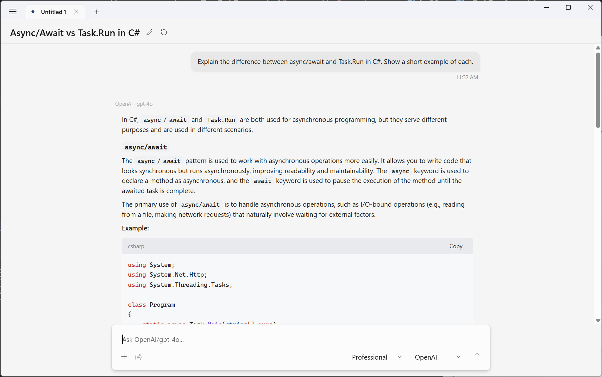
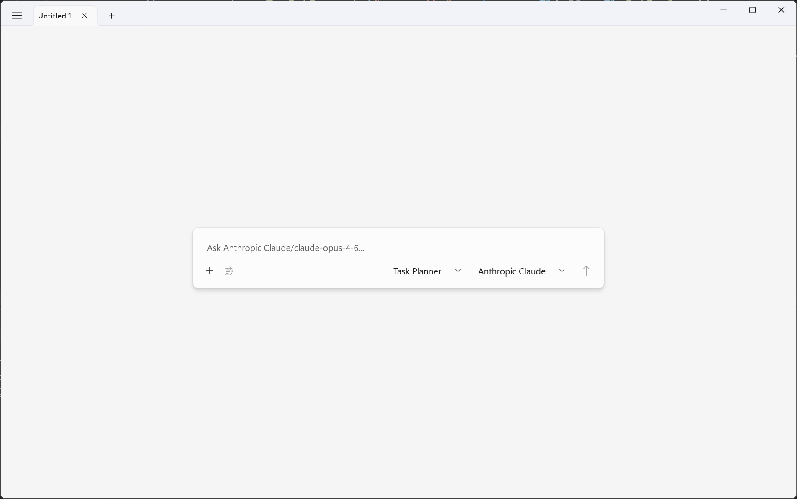
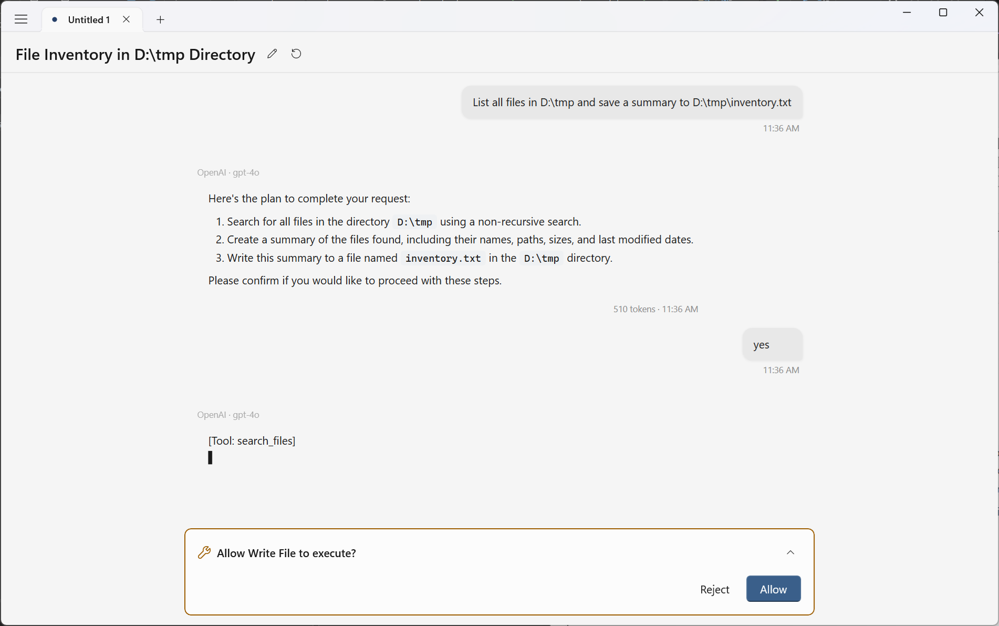

# FieldCure AssistStudio

**AI Chat Controls for WinUI 3 + Windows AI Workspace App — Bring Your Own Key, pick any provider.**

[](https://www.nuget.org/packages/FieldCure.AssistStudio.Core)
[](https://www.nuget.org/packages/FieldCure.AssistStudio.Controls.WinUI)
[](LICENSE)
[](https://dotnet.microsoft.com/)

AssistStudio is two things:

1. **A reusable WinUI 3 library** (two NuGet packages) for building desktop AI assistants with multi-provider support, tool approval, and profile-based behavior.
2. **A Windows-native AI workspace app** for cloud and local models, profiles, tools, and structured conversations.



---

## Features

- **BYOK (Bring Your Own Key)** — Users supply their own API keys. No proxy, no middleman.
- **Multi-Provider** — Claude, OpenAI, Gemini, Ollama, and Groq out of the box. Implement `IAiProvider` to add your own.
- **Streaming** — Real-time structured event streaming via `IAsyncEnumerable<StreamEvent>` — a discriminated union covering text, thinking, tool calls, usage, and completion.
- **Extended Thinking** — Per-provider thinking/reasoning support (Claude extended thinking, OpenAI o-series reasoning, Ollama think tags). Configurable via `ThinkingOverride` and `ThinkingBudget`.
- **Conversation Branching** — Tree-based message editing with branch navigator (◀ 1/2 ▶). Edit any message to explore alternatives without losing history.
- **MCP Integration** — Connect to MCP servers (Stdio / HTTP) to aggregate tools from any Model Context Protocol source. `McpToolAdapter` bridges MCP tools to the `IAssistTool` pipeline.
- **Built-in MCP Servers** — Filesystem server ships as a built-in, auto-installed via `dotnet tool`. Per-tab instances with MCP Roots protocol support for dynamic workspace folder updates.
- **Vision & Documents** — Attach images (PNG, JPG, WebP, GIF), PDFs, and DOCX files. Per-provider `PdfCapability` (Auto / TextExtraction / NativePdf / PageAsImage).
- **Tool / Function Calling** — Define tools with `IAssistTool`. `ToolCallExecutor` orchestrates execution with confirmation flow. `ToolApprovalPanel` shows inline approval UI.
- **Token Tracking** — Input/output token counts exposed after every request.
- **Re-templatable WinUI 3 Controls** — `ChatPanel`, `InputContainer`, `AttachmentPreviewBar`, and `ToolApprovalPanel` are `TemplatedControl`s. Override `Generic.xaml` to fully customize the UI.
- **Profiles & Presets** — Save provider configurations as presets; switch system prompts and tool selections with profiles.
- **Workspace Context** — `IWorkspaceContext` for dynamic system prompt injection based on app state.
- **Conversation Persistence** — Save and load conversations in `.astd` (JSON) format with full branching tree.
- **Localization** — Built-in en-US and ko-KR resource strings.
- **Structured Logging** — `DiagnosticLogger` with pluggable `OnException`, `OnWarning`, `OnInfo` callbacks.

---

## Screenshots

<table>
  <tr>
    <th align="center">Empty State</th>
    <th align="center">Tool Approval</th>
  </tr>
  <tr>
    <td align="center"></td>
    <td align="center"></td>
  </tr>
</table>

---

## Architecture

```
                        ┌──────────────────────┐
                        │   MCP Servers         │
                        │  (Stdio / HTTP)       │
                        └──────────┬───────────┘
                                   │ McpToolAdapter
┌──────────────────────────────────┼──────────────────┐
│  AssistStudio (Workspace App)                       │
│  WinUI 3 — MCP · Built-in Servers · Profiles        │
├─────────────────────────────────────────────────────┤
│  AssistStudio.Controls            ← NuGet package   │
│  ChatPanel · Branching · ThinkingBlock · EditMode   │
│  WebView2 rendering · Themes · Localization         │
├─────────────────────────────────────────────────────┤
│  AssistStudio.Core                ← NuGet package   │
│  IAiProvider · StreamEvent · IAssistTool · Models   │
│  Claude │ OpenAI │ Gemini │ Ollama │ Groq           │
└─────────────────────────────────────────────────────┘
```

| Project | NuGet Package | TFM | Key Types |
|---------|--------------|-----|-----------|
| **AssistStudio.Core** | `FieldCure.AssistStudio.Core` | `net8.0` | `IAiProvider`, `StreamEvent`, `IAssistTool`, `AiRequest`, `AiResponse`, `ChatMessage`, `ToolCallExecutor`, `ToolResolver`, `McpToolAdapter`, `IWorkspaceContext`, `ProviderPreset`, `Profile`, `ConversationManager` |
| **AssistStudio.Controls** | `FieldCure.AssistStudio.Controls.WinUI` | `net8.0-windows10.0.19041.0`<br>`net9.0-windows10.0.19041.0` | `ChatPanel`, `InputContainer`, `AttachmentPreviewBar`, `ToolApprovalPanel`, `ChatTheme` |
| **AssistStudio** | *(workspace app)* | `net9.0-windows10.0.19041.0` | Reference implementation with settings, MCP server management, built-in tools, and `PasswordVaultHelper` |

> **Core is platform-agnostic** (`net8.0`). It has no Windows-specific dependencies — you can reference it from a console app, a server, or any .NET project.

---

## Quick Start

### 1. Install packages

```bash
dotnet add package FieldCure.AssistStudio.Core
dotnet add package FieldCure.AssistStudio.Controls.WinUI
```

### 2. Create a provider and wire up the control

```csharp
using FieldCure.AssistStudio.Providers;

// Pick a provider — API key comes from the user
var provider = new ClaudeProvider(apiKey: "sk-ant-...", modelId: "claude-sonnet-4-20250514");
```

```xml
<!-- In your WinUI 3 Page -->
<Page xmlns:assist="using:FieldCure.AssistStudio.Controls">

    <assist:ChatPanel x:Name="Chat"
                      Placeholder="Ask anything..."
                      Theme="System" />
</Page>
```

```csharp
// Code-behind
Chat.Provider = provider;
```

That's it — you have a fully functional AI chat with streaming, Markdown rendering, syntax highlighting, thinking blocks, and conversation branching.

### 3. Streaming with StreamEvent

```csharp
var request = new AiRequest("Explain quantum computing.");

await foreach (var evt in provider.StreamAsync(request))
{
    switch (evt)
    {
        case StreamEvent.ThinkingDelta t:
            Console.Write($"[think] {t.Text}");
            break;
        case StreamEvent.TextDelta d:
            Console.Write(d.Text);
            break;
        case StreamEvent.ToolCallStart s:
            Console.WriteLine($"\n→ Calling {s.FunctionName}...");
            break;
        case StreamEvent.Usage u:
            Console.WriteLine($"\nTokens: {u.TokenUsage.TotalTokens}");
            break;
    }
}
```

---

## Providers

### Supported providers

| Provider | Streaming | Vision | Documents | Tool Calling | Thinking | API Key Required |
|----------|:---------:|:------:|:---------:|:------------:|:--------:|:----------------:|
| **Claude** (Anthropic) | Yes | Yes | Yes | Yes | Yes | Yes |
| **OpenAI** (+ compatible) | Yes | Yes | Yes | Yes | o-series | Yes |
| **Gemini** (Google) | Yes | Yes | Yes | Yes | No | Yes |
| **Ollama** (local) | Yes | Dep. | Dep. | Dep. | think tags | No |
| **Groq** | Yes | Yes | Yes | Yes | Dep. | Yes |

> OpenAI provider works with any OpenAI-compatible API (Groq, Azure OpenAI, etc.) by setting a custom `baseUrl`.

### Implementing a custom provider

Implement `IAiProvider` to integrate any AI service:

```csharp
using FieldCure.AssistStudio.Models;
using FieldCure.AssistStudio.Providers;

public class MyCustomProvider : IAiProvider
{
    public string ProviderName => "MyService";
    public string ModelId => "my-model-v1";
    public TokenUsage? LastUsage { get; private set; }
    public bool IsTruncated { get; private set; }
    public string? LastRequestBody { get; private set; }
    public string? LastRawResponse { get; private set; }
    public PdfCapability PdfCapability => PdfCapability.TextExtraction;

    public async Task<AiResponse> CompleteAsync(AiRequest request, CancellationToken ct = default)
    {
        // Call your API, return an AiResponse
        throw new NotImplementedException();
    }

    public async IAsyncEnumerable<StreamEvent> StreamAsync(
        AiRequest request,
        [EnumeratorCancellation] CancellationToken ct = default)
    {
        yield return new StreamEvent.TextDelta("Hello ");
        yield return new StreamEvent.TextDelta("from MyService!");
        yield return new StreamEvent.StreamCompleted(false);
    }

    public Task<IReadOnlyList<AiModel>> ListModelsAsync(CancellationToken ct = default)
        => Task.FromResult<IReadOnlyList<AiModel>>(
            [new AiModel("my-model-v1", "My Model", "myservice")]);

    public Task<ConnectionInfo> ValidateConnectionAsync(CancellationToken ct = default)
        => Task.FromResult(new ConnectionInfo(true, null, null, null));

    public ThinkingSupport GetThinkingSupport(string modelId)
        => ThinkingSupport.NotSupported;
}
```

Then assign it to a `ChatPanel`:

```csharp
Chat.Provider = new MyCustomProvider();
```

---

## Controls

All controls are **TemplatedControls** defined in `Generic.xaml`. They carry no app-level dependency — reference the NuGet package and use them in any WinUI 3 project.

### ChatPanel

The main control. Provides a complete chat experience: message list (WebView2), input area, streaming, thinking blocks, conversation branching, attachments, presets, and profiles.

```xml
<assist:ChatPanel Provider="{x:Bind ViewModel.Provider, Mode=OneWay}"
                  SystemPrompt="You are a helpful assistant."
                  Theme="Dark"
                  Placeholder="Type a message..."
                  AvailablePresets="{x:Bind ViewModel.Presets}"
                  SelectedPreset="{x:Bind ViewModel.CurrentPreset, Mode=TwoWay}"
                  RegisteredTools="{x:Bind ViewModel.Tools}"
                  WorkspaceContext="{x:Bind ViewModel.Workspace}" />
```

**Key dependency properties:** `Provider`, `SystemPrompt`, `Theme`, `Title`, `Placeholder`, `AvailablePresets`, `SelectedPreset`, `AvailableProfiles`, `SelectedProfile`, `RegisteredTools`, `WorkspaceContext`, `UtilityProvider`, `AutoTitle`, `AutoSummarize`, `MaxInputTokens`, `MaxToolCallRounds`, `RecentTurnsToKeep`, `IsDebugMode`, `ShowTitleBar`, `AllowAttachments`, `IsReadOnly`, `FontFamily`, `FontSize`, `EmptyStateContent`

**Events:** `PresetChanged`, `ProfileChanged`, `MessageAdded`, `TitleGenerated`, `TitleEditRequested`, `KeyboardShortcutPressed`

### InputContainer

The chat input area — text box, attach button, preset/profile selectors. Used internally by `ChatPanel`, but can be placed standalone.

### AttachmentPreviewBar

Horizontal scrollable bar showing thumbnails of attached files before sending.

### ToolApprovalPanel

Inline confirmation panel shown when a tool with `RequiresConfirmation = true` is invoked. Displays the tool name, an expandable JSON arguments preview, and Allow/Reject buttons. Replaces `InputContainer` during confirmation and restores it after.

### Re-templating

Override the default template in your app's resources:

```xml
<Style TargetType="assist:ChatPanel" BasedOn="{StaticResource DefaultChatPanelStyle}">
    <!-- Customize template parts: PART_MessageList, PART_InputArea, PART_TitleBar, etc. -->
</Style>
```

---

## MCP Integration

The workspace app demonstrates full MCP (Model Context Protocol) integration:

- **McpServerRegistry** — Singleton server connection manager with observable tool collection
- **McpServerConnection** — Per-server lifecycle (Disconnected → Connecting → Connected / Error)
- **McpToolAdapter** — Bridges MCP tools to `IAssistTool` without Core SDK dependency
- **ToolResolver** — Merges built-in + MCP tools, prefixing MCP tool names with server name on conflict
- **SearchToolsTool** — Meta-tool for searching across large MCP tool sets to save tokens

MCP servers are configured with Stdio or HTTP transport and connected at app startup. Tools from all connected servers are aggregated and made available to providers.

### Built-in MCP Servers

The workspace app bundles MCP servers that are auto-installed and managed:

- **Filesystem** (`FieldCure.Mcp.Filesystem`) — Secure file operations within workspace folders. Per-tab instances with MCP Roots protocol for dynamic folder updates.
- **BuiltInServerHelper** — Auto-installs and updates built-in servers via `dotnet tool` on app startup. Read-only tools (read, list, search) skip user approval.

---

## Configuration

### Provider presets

```csharp
var preset = new ProviderPreset
{
    Name = "Claude Sonnet",
    ProviderType = "Claude",
    ApiKey = "sk-ant-...",
    ModelId = "claude-sonnet-4-20250514",
    Temperature = 0.7,
    MaxTokens = 4096,
    StreamingEnabled = true,
    ThinkingEnabled = true,
    ThinkingBudget = 8192
};
```

### Profiles

Profiles pair a system prompt with optional provider/model preferences and tool selections:

```csharp
var profile = new Profile
{
    Name = "Task Planner",
    Text = "You are a task planner that breaks down complex requests into steps.",
    ToolNames = ["search_files", "read_file", "write_file", "run_command"],
    UseSearchTools = true  // Use meta-tool instead of sending all tool definitions
};
```

---

## Requirements

| Dependency | Minimum Version |
|------------|----------------|
| .NET | 8.0 |
| Windows App SDK | 1.7 |
| WebView2 Runtime | Evergreen |
| Target Platform | Windows 10 1903+ (10.0.19041.0) |

---

## Contributing

Contributions are welcome! Please open an issue first to discuss what you'd like to change.

1. Fork the repository
2. Create a feature branch (`git checkout -b feature/amazing-feature`)
3. Commit your changes
4. Push to the branch and open a Pull Request

---

## License

[MIT](LICENSE) — Copyright (c) 2026 FieldCure Co., Ltd.
