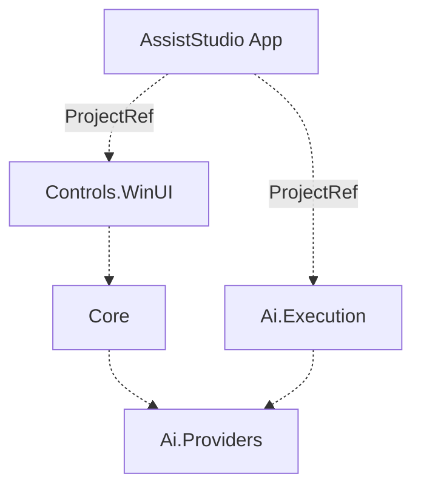
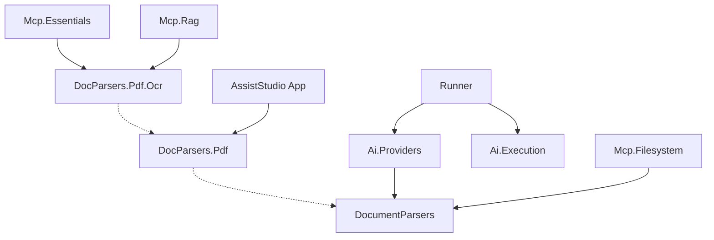

# AssistStudio Dependency Graph

Cross-repository dependency map for the AssistStudio ecosystem.

> **Legend** — Solid line: NuGet PackageReference / Dashed line: ProjectReference (same solution)  
> All packages use the `FieldCure.` prefix (omitted for readability)

## Internal Structure (assiststudio solution)

## Cross-Repository Dependencies

> Mcp.Outbox, Mcp.PublicData.Kr — No FieldCure internal dependencies (external NuGet only)

## Package Index

| Package | Version | Repository | Type |
|---|---|---|---|
| AssistStudio (App) | — | fieldcure-assiststudio | WinUI App |
| Controls.WinUI |  | fieldcure-assiststudio | Library |
| Core |  | fieldcure-assiststudio | Library |
| Ai.Providers |  | fieldcure-assiststudio | Library |
| Ai.Execution |  | fieldcure-assiststudio | Library |
| Runner |  | fieldcure-assiststudio-runner | dotnet tool |
| DocumentParsers |  | fieldcure-document-parsers | Library |
| DocumentParsers.Pdf |  | fieldcure-document-parsers | Library |
| DocumentParsers.Pdf.Ocr |  | fieldcure-document-parsers | Library |
| Mcp.Essentials |  | fieldcure-mcp-essentials | dotnet tool |
| Mcp.Rag |  | fieldcure-mcp-rag | dotnet tool |
| Mcp.Filesystem |  | fieldcure-mcp-filesystem | dotnet tool |
| Mcp.Outbox |  | fieldcure-mcp-outbox | dotnet tool |
| Mcp.PublicData.Kr |  | fieldcure-mcp-publicdata | dotnet tool |

## Notes

- **Essentials / Rag**: Both explicitly reference all three DocumentParsers packages. Referencing Pdf.Ocr alone would be sufficient via transitive dependencies.
- **Outbox / PublicData.Kr**: No FieldCure internal package dependencies (external NuGet only).
