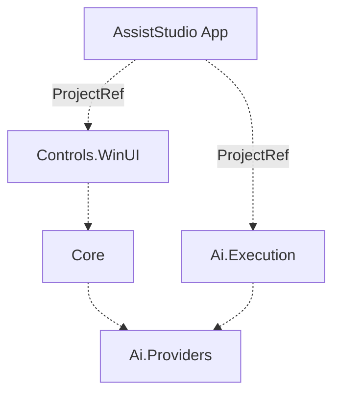
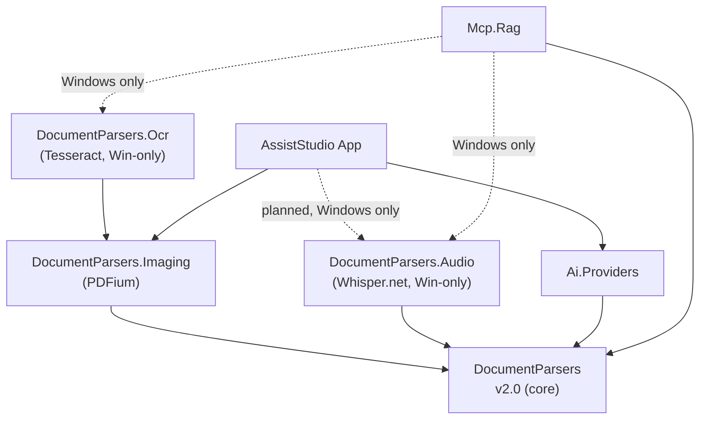
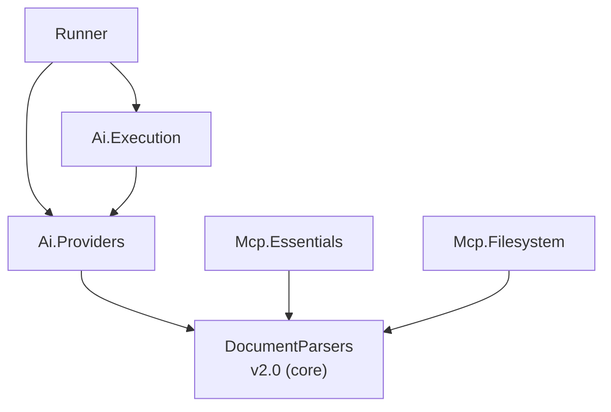

# AssistStudio Dependency Graph

Cross-repository dependency map for the AssistStudio ecosystem.

> **Legend** — Solid line: NuGet PackageReference / Dashed line: ProjectReference (same solution)
> All packages use the `FieldCure.` prefix (omitted for readability)

## Internal Structure (assiststudio solution)

## Cross-Repository Dependencies

The cross-repo graph has two natural clusters. The **content pipeline** focuses on
how documents and audio reach LLMs through DocumentParsers extraction. The
**execution & tooling** layer is the agent runtime plus generic MCP tool servers
that don't drive LLM-facing content extraction directly.

### Content pipeline (App & RAG centric)

- **App** registers `AddImagingSupport()` so PDFs attach as rendered pages for
  vision models. Text-only `IDocumentParser` access flows transitively through
  `Ai.Providers`. `.Audio` registration is planned so audio attachments
  (meeting recordings, voice memos) get transcribed before being sent to LLMs.
- **Rag** indexes documents into FTS5 + vector store. `.Ocr` and `.Audio` are
  optional MSBuild-conditional references (Windows-only) gated by `WINDOWS_OCR`
  and `WINDOWS_AUDIO` compile symbols — Linux builds produce a cross-platform
  server with text-only PDF indexing and no audio transcription. The Audio
  integration also stamps every transcript chunk with `audio.model_size` and
  `audio.transcribed_at` so a future hardware upgrade can identify reindex
  candidates without re-parsing source files.

### Execution & tooling (Runner & MCP servers)

- **Runner** is a generic dotnet tool that hosts MCP servers and AI providers; it
  doesn't extract document content itself.
- **Mcp.Essentials** uses `DocumentParsers` for web content / file reads.
- **Mcp.Filesystem** also hosts `convert_to_markdown` /
  `convert_directory_to_markdown` tools backed by `DocumentParsers`.

> **Mcp.Outbox** and **Mcp.PublicData.Kr** are intentionally omitted from both
> diagrams — they have no FieldCure internal package dependencies (external
> NuGet only).

### DocumentParsers package history

The old `DocumentParsers.Pdf` / `DocumentParsers.Pdf.Ocr` packages were
**deprecated** in 2026-04 (Core v2.0). Audio transcription was added as a new
opt-in package in 2026-04 (Core v2.0.1 + Audio v0.1.0); Audio v0.2.0 (2026-04-27)
added environment-aware Whisper model size recommendation
(`WhisperEnvironment.RecommendModelSize`) plus `AudioExtractionOptions.WithModelSize`.

| v1.x package | v2.x replacement | Notes |
|---|---|---|
| `DocumentParsers` 1.x | `DocumentParsers` **2.0** | PdfPig (pure C#) promoted to core; `PdfParser` auto-registers |
| `DocumentParsers.Pdf` 1.x | `DocumentParsers.Imaging` 1.x | PDFium page rendering (native); was bundled with text extraction |
| `DocumentParsers.Pdf.Ocr` 1.x | `DocumentParsers.Ocr` 1.x | Tesseract fallback; Windows-only (`[SupportedOSPlatform("windows")]`) |
| — (new) | `DocumentParsers.Audio` 0.2 | Whisper.net audio transcription (.mp3, .wav, .m4a, .ogg, .flac, .webm) + env-aware model size selection; Windows-only |

Net effect: the core package stays pure-managed (no native binaries). Consumers
opt into `.Imaging` for page rendering, `.Ocr` for scanned-PDF fallback, and
`.Audio` for speech-to-text. Each native runtime is additive — pick only what
you need.

### Consumer matrix (current)

| Consumer | DP core | .Imaging | .Ocr | .Audio | Notes |
|---|:---:|:---:|:---:|:---:|---|
| Ai.Providers | ✅ | — | — | — | Text extraction for document attachments; `IMediaDocumentParser` cast resolves via `.Imaging` when App registers it |
| AssistStudio App | (via Ai.Providers) | ✅ | — | 🟡 (planned, Win only) | Registers `AddImagingSupport()` at startup so PDFs attach as rendered pages for vision models. `AddAudioSupport()` registration planned for audio attachment transcription. |
| Mcp.Essentials | ✅ | — | — | — | Text-only document read; OCR removed in this refactor |
| Mcp.Filesystem | ✅ | — | — | — | Also hosts `convert_to_markdown` / `convert_directory_to_markdown` tools |
| Mcp.Rag | ✅ | — | ✅ (Win only) | ✅ (Win only) | Both `.Ocr` and `.Audio` referenced via MSBuild `Condition="$([MSBuild]::IsOSPlatform('Windows'))"`; `WINDOWS_OCR` and `WINDOWS_AUDIO` compile symbols gate the `AddOcrSupport` / `AddAudioSupport` calls. Audio model size auto-selected at startup via `WhisperEnvironment.RecommendModelSize(QualityBias.Accuracy)`; per-chunk metadata records `audio.model_size` and `audio.transcribed_at` for reindex auditing. Linux builds produce a cross-platform server with text-only PDF indexing and no audio transcription. Shipped in Mcp.Rag v2.3.0. |

## MCP Servers: Platform & Credential Posture

All FieldCure MCP servers target `net8.0` and are cross-platform at the TFM level. The table below summarises **actual** runtime platform behaviour and credential handling after the 2026-04 refactor. Credential policy follows [ADR-001](./ADR-001-MCP-Credential-Management.md).

| Server | Platform | Credentials needed | Resolution chain | Elicitation |
|---|---|---|---|---|
| **Essentials** | ✅ Cross-platform | Search API keys (Serper / SerpApi / Tavily) | **Auto mode**: env scan → free fallback. **Explicit mode**: CLI → env → Elicit → fallback-consent Elicit → soft fail | ✅ Explicit-engine only (v2.2, in design) |
| **Filesystem** | ✅ Cross-platform | None | CLI positional args (allowed directories) | — |
| **Rag** | ✅ Cross-platform (OCR/Audio Windows-only) | Embedding / contextualizer API keys | **serve**: env → Elicit (max 2 re-elicits, session cache). **exec / exec-queue**: env only → soft fail | ✅ serve mode only |
| **Outbox** | ✅ Cross-platform | Per-channel secrets (static) + OAuth tokens (dynamic) | cache → env (`OUTBOX_{id}_{field}`) → `channels.json` (local-trust, see ADR Principle 2) → Elicit → soft fail. OAuth tokens in `tokens.json` with user-only file permissions. | ✅ |
| **PublicData.Kr** | ✅ Cross-platform | `DATA_GO_KR_API_KEY` | env → Elicit (max 2 re-elicits) | ✅ |

**Credential classification** (ADR-001 §Credential classification):

- **Static secret** (API keys, bot tokens, webhook URLs, SMTP passwords) → host responsibility. AssistStudio stores in PasswordVault and injects as env vars at MCP spawn time. No MCP server owns a platform credential store.
- **Dynamic credential** (OAuth access/refresh tokens) → server responsibility (`tokens.json` + file permissions). Applies to Outbox KakaoTalk / Microsoft channels.

**Cross-platform status** (all `net8.0`, no `advapi32` P/Invoke, no `#pragma warning disable CA1416`):

- Essentials: 100% managed code.
- Filesystem: 100% managed code.
- Rag: 100% managed code on Linux/macOS. On Windows, optional `.Ocr` and `.Audio` packages bring Tesseract and Whisper.net native binaries respectively.
- Outbox: 100% managed code. Legacy v1.x Windows CredentialManager store was removed in v2.0; the `migrate-credentials.ps1` script (one-shot user migration tool) is the only remaining code path that touches `advapi32` and it is not built into the server.

## Package Index

| Package | Version | Repository | Type |
|---|---|---|---|
| AssistStudio (App) | — | fieldcure-assiststudio | WinUI App |
| Controls.WinUI |  | fieldcure-assiststudio | Library |
| Core |  | fieldcure-assiststudio | Library |
| Ai.Providers |  | fieldcure-assiststudio | Library |
| Ai.Execution |  | fieldcure-assiststudio | Library |
| Runner |  | fieldcure-assiststudio-runner | dotnet tool |
| DocumentParsers |  | fieldcure-document-parsers | Library |
| DocumentParsers.Imaging |  | fieldcure-document-parsers | Library |
| DocumentParsers.Ocr |  | fieldcure-document-parsers | Library (Windows-only) |
| DocumentParsers.Audio |  | fieldcure-document-parsers | Library (Windows-only) |
| Mcp.Essentials |  | fieldcure-mcp-essentials | dotnet tool |
| Mcp.Rag |  | fieldcure-mcp-rag | dotnet tool |
| Mcp.Filesystem |  | fieldcure-mcp-filesystem | dotnet tool |
| Mcp.Outbox |  | fieldcure-mcp-outbox | dotnet tool |
| Mcp.PublicData.Kr |  | fieldcure-mcp-publicdata | dotnet tool |

### Deprecated

| Package | Deprecated in | Alternative |
|---|---|---|
| `FieldCure.DocumentParsers.Pdf` 1.x | 2026-04 | `FieldCure.DocumentParsers` 2.x (text) + `FieldCure.DocumentParsers.Imaging` (images) |
| `FieldCure.DocumentParsers.Pdf.Ocr` 1.x | 2026-04 | `FieldCure.DocumentParsers.Ocr` 1.x (rename) |

## Notes

- **Runner** consumes `Ai.Providers` / `Ai.Execution` as NuGet packages (not ProjectReference). Any change to those two libraries that affects Runner behaviour must be published before bumping Runner.
- **AssistStudio App → MCP servers**: injection of host-held static secrets into MCP child processes happens via `ProcessStartInfo.EnvironmentVariables`. PasswordVault is Windows-only and lives exclusively on the host side.
- **Adding a new DocumentParsers consumer**: default to `DocumentParsers` core only. Add `.Imaging` only when page-to-image rendering is actually needed. Add `.Ocr` only when scanned PDF indexing matters and the consumer is OK being tagged Windows-only (or providing its own platform guard). Add `.Audio` only when speech-to-text is required — same Windows-only caveat applies, and the Whisper ggml model is downloaded at runtime to `{UserProfile}/.fieldcure/whisper-models/`.
