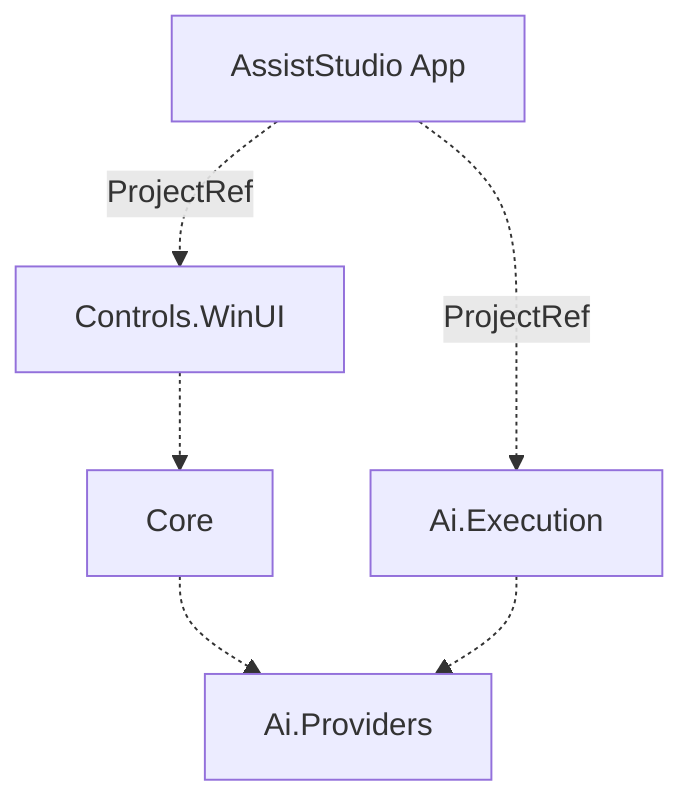
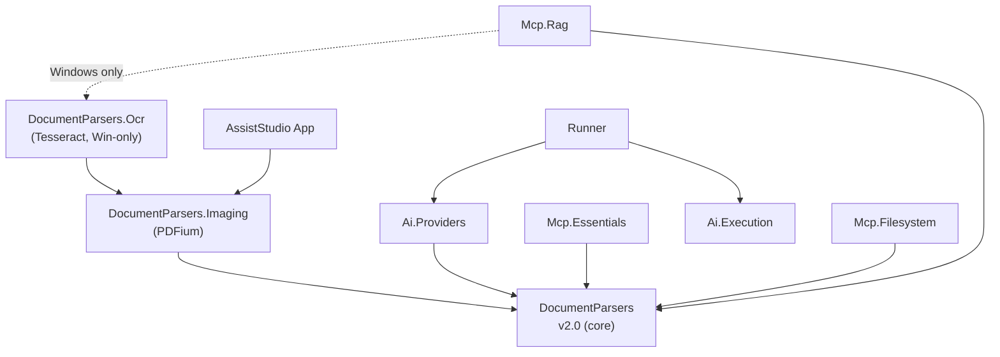

# AssistStudio Dependency Graph

Cross-repository dependency map for the AssistStudio ecosystem.

> **Legend** — Solid line: NuGet PackageReference / Dashed line: ProjectReference (same solution)
> All packages use the `FieldCure.` prefix (omitted for readability)

## Internal Structure (assiststudio solution)

## Cross-Repository Dependencies

> **Mcp.Outbox** and **Mcp.PublicData.Kr** are intentionally omitted — they have no FieldCure internal package dependencies (external NuGet only).

### DocumentParsers v2.0 Restructuring (2026-04 completed)

The old `DocumentParsers.Pdf` / `DocumentParsers.Pdf.Ocr` packages are **deprecated**:

| v1.x package | v2.x replacement | Notes |
|---|---|---|
| `DocumentParsers` 1.x | `DocumentParsers` **2.0** | PdfPig (pure C#) promoted to core; `PdfParser` auto-registers |
| `DocumentParsers.Pdf` 1.x | `DocumentParsers.Imaging` 1.x | PDFium page rendering (native); was bundled with text extraction |
| `DocumentParsers.Pdf.Ocr` 1.x | `DocumentParsers.Ocr` 1.x | Tesseract fallback; Windows-only (`[SupportedOSPlatform("windows")]`) |

Net effect: consumers that only need PDF **text** extraction no longer pull the PDFium native binary. Consumers that need page images take `.Imaging`; OCR fallback is additive on top.

### Consumer matrix (current)

| Consumer | DP core | .Imaging | .Ocr | Notes |
|---|:---:|:---:|:---:|---|
| Ai.Providers | ✅ | — | — | Text extraction for document attachments; `IMediaDocumentParser` cast resolves via `.Imaging` when App registers it |
| AssistStudio App | (via Ai.Providers) | ✅ | — | Registers `AddImagingSupport()` at startup so PDFs attach as rendered pages for vision models |
| Mcp.Essentials | ✅ | — | — | Text-only document read; OCR removed in this refactor |
| Mcp.Filesystem | ✅ | — | — | Also hosts `convert_to_markdown` / `convert_directory_to_markdown` tools |
| Mcp.Rag | ✅ | — | ✅ (Win only) | `.Ocr` referenced via MSBuild `Condition="$([MSBuild]::IsOSPlatform('Windows'))"`; `WINDOWS_OCR` compile symbol gates the `AddOcrSupport` call. Linux builds produce a cross-platform server with text-only PDF indexing. |

## MCP Servers: Platform & Credential Posture

All FieldCure MCP servers target `net8.0` and are cross-platform at the TFM level. The table below summarises **actual** runtime platform behaviour and credential handling after the 2026-04 refactor. Credential policy follows [ADR-001](./ADR-001-MCP-Credential-Management.md).

| Server | Platform | Credentials needed | Resolution chain | Elicitation |
|---|---|---|---|---|
| **Essentials** | ✅ Cross-platform | Search API keys (Serper / SerpApi / Tavily) | **Auto mode**: env scan → free fallback. **Explicit mode**: CLI → env → Elicit → fallback-consent Elicit → soft fail | ✅ Explicit-engine only (v2.2, in design) |
| **Filesystem** | ✅ Cross-platform | None | CLI positional args (allowed directories) | — |
| **Rag** | ✅ Cross-platform (OCR Windows-only) | Embedding / contextualizer API keys | **serve**: env → Elicit (max 2 re-elicits, session cache). **exec / exec-queue**: env only → soft fail | ✅ serve mode only |
| **Outbox** | ✅ Cross-platform | Per-channel secrets (static) + OAuth tokens (dynamic) | cache → env (`OUTBOX_{id}_{field}`) → `channels.json` (local-trust, see ADR Principle 2) → Elicit → soft fail. OAuth tokens in `tokens.json` with user-only file permissions. | ✅ |
| **PublicData.Kr** | ✅ Cross-platform | `DATA_GO_KR_API_KEY` | env → Elicit (max 2 re-elicits) | ✅ |

**Credential classification** (ADR-001 §Credential classification):

- **Static secret** (API keys, bot tokens, webhook URLs, SMTP passwords) → host responsibility. AssistStudio stores in PasswordVault and injects as env vars at MCP spawn time. No MCP server owns a platform credential store.
- **Dynamic credential** (OAuth access/refresh tokens) → server responsibility (`tokens.json` + file permissions). Applies to Outbox KakaoTalk / Microsoft channels.

**Cross-platform status** (all `net8.0`, no `advapi32` P/Invoke, no `#pragma warning disable CA1416`):

- Essentials: 100% managed code.
- Filesystem: 100% managed code.
- Rag: 100% managed code on Linux/macOS. On Windows an optional `.Ocr` package brings Tesseract native binaries.
- Outbox: 100% managed code. Legacy v1.x Windows CredentialManager store was removed in v2.0; the `migrate-credentials.ps1` script (one-shot user migration tool) is the only remaining code path that touches `advapi32` and it is not built into the server.

## Package Index

| Package | Version | Repository | Type |
|---|---|---|---|
| AssistStudio (App) | — | fieldcure-assiststudio | WinUI App |
| Controls.WinUI |  | fieldcure-assiststudio | Library |
| Core |  | fieldcure-assiststudio | Library |
| Ai.Providers |  | fieldcure-assiststudio | Library |
| Ai.Execution |  | fieldcure-assiststudio | Library |
| Runner |  | fieldcure-assiststudio-runner | dotnet tool |
| DocumentParsers |  | fieldcure-document-parsers | Library |
| DocumentParsers.Imaging |  | fieldcure-document-parsers | Library |
| DocumentParsers.Ocr |  | fieldcure-document-parsers | Library (Windows-only) |
| Mcp.Essentials |  | fieldcure-mcp-essentials | dotnet tool |
| Mcp.Rag |  | fieldcure-mcp-rag | dotnet tool |
| Mcp.Filesystem |  | fieldcure-mcp-filesystem | dotnet tool |
| Mcp.Outbox |  | fieldcure-mcp-outbox | dotnet tool |
| Mcp.PublicData.Kr |  | fieldcure-mcp-publicdata | dotnet tool |

### Deprecated

| Package | Deprecated in | Alternative |
|---|---|---|
| `FieldCure.DocumentParsers.Pdf` 1.x | 2026-04 | `FieldCure.DocumentParsers` 2.x (text) + `FieldCure.DocumentParsers.Imaging` (images) |
| `FieldCure.DocumentParsers.Pdf.Ocr` 1.x | 2026-04 | `FieldCure.DocumentParsers.Ocr` 1.x (rename) |

## Notes

- **Runner** consumes `Ai.Providers` / `Ai.Execution` as NuGet packages (not ProjectReference). Any change to those two libraries that affects Runner behaviour must be published before bumping Runner.
- **AssistStudio App → MCP servers**: injection of host-held static secrets into MCP child processes happens via `ProcessStartInfo.EnvironmentVariables`. PasswordVault is Windows-only and lives exclusively on the host side.
- **Adding a new DocumentParsers consumer**: default to `DocumentParsers` core only. Add `.Imaging` only when page-to-image rendering is actually needed. Add `.Ocr` only when scanned PDF indexing matters and the consumer is OK being tagged Windows-only (or providing its own platform guard).
