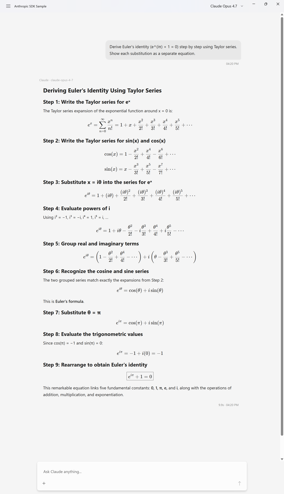
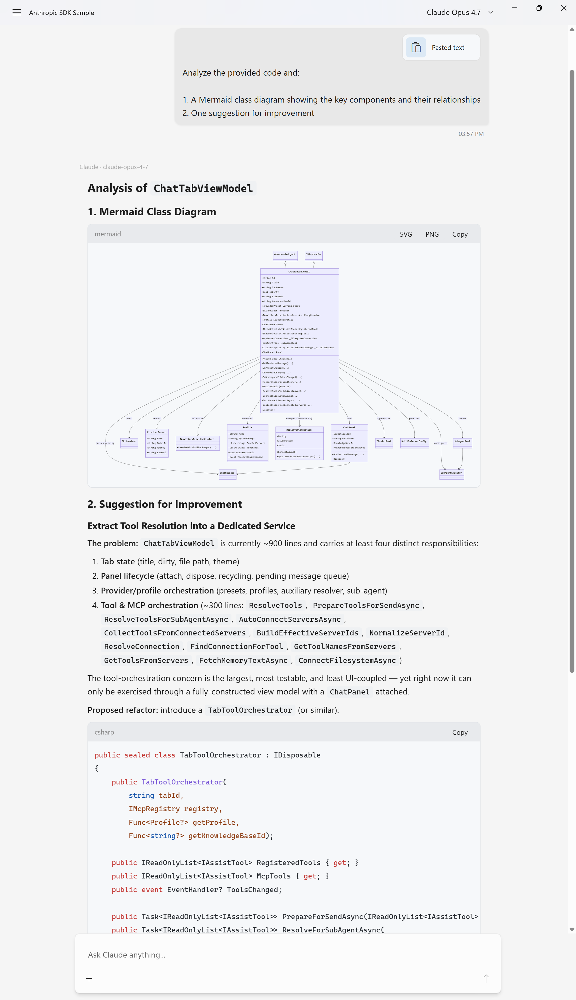
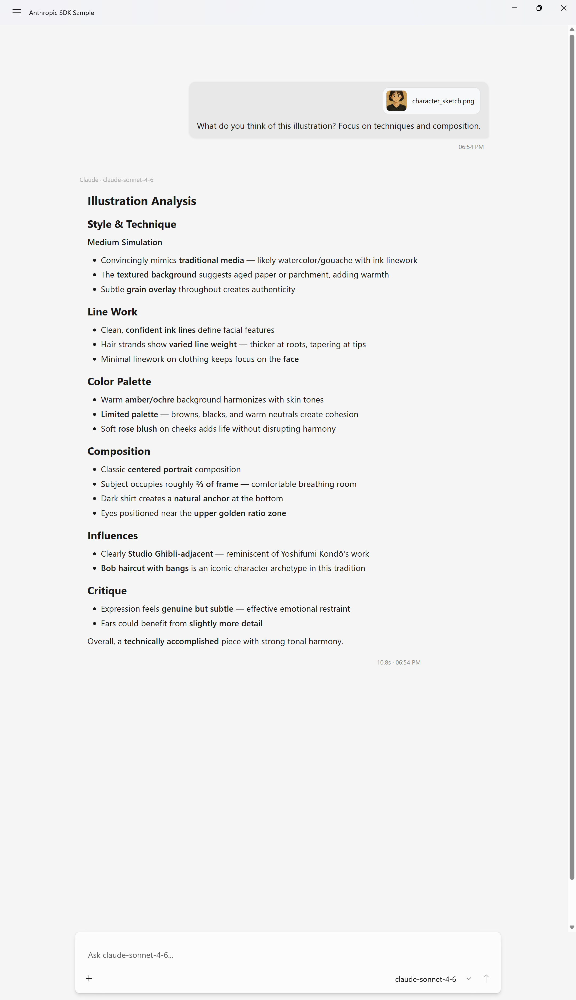

# AnthropicSdkSample

A minimal sample app that streams directly from the Anthropic C# SDK into a `ChatPanel`.
Demonstrates real-world usage of the `FieldCure.AssistStudio.Controls.WinUI.Anthropic` package.

<p align="center">
  
</p>

## Prerequisites

- Visual Studio 2022 17.12+
- .NET 9.0 SDK
- Windows App SDK 1.7+
- Anthropic API Key ([console.anthropic.com](https://console.anthropic.com/))

## Scope

This sample focuses on the **core streaming integration** — showing how to bridge the
Anthropic C# SDK to `ChatPanel` with minimal code. It is intentionally not a full-featured
chat application.

**What this sample demonstrates:**

- Text streaming via `StreamAnthropicAsync` → live `ChatPanel` rendering
- Thinking block streaming (`ThinkingDelta` mapping)
- Image and text file attachments (vision + inline text)
- Multi-turn conversations (`GetConversationAsAnthropicMessages` converts full history)
- **Tool calling** — built-in `fetch` tool (HTTP GET with SSRF guard) wired through
  `IAssistTool` + `BuildAnthropicParams(... tools)`, with a single-handle multi-round
  loop and inline tool blocks rendered under the assistant bubble (see [Tool calling](#tool-calling) below)
- Runtime model switching (Opus / Sonnet / Haiku)
- Stop button — cancels the active stream mid-response via `CancellationToken`
- Secure API key storage via Windows Credential Manager (DPAPI)
- Markdown, code highlighting, and KaTeX rendering (WebView2-based)

**What this sample does not include:**

- System prompts (no UI — can be enabled by one line in `OnUserMessageSubmitted`)
- Tool approval UI (`ToolApprovalPanel`) — the built-in `fetch` tool auto-approves;
  flip `FetchTool.RequiresConfirmation` to `true` and wire the panel's approval/decline
  events to demonstrate the interactive path
- Thinking signature round-trip when combined with tool use (Phase B of the adapter
  integration — required when extended thinking is enabled alongside tool calls)
- Conversation persistence (history is lost on app close)
- Auto-title / auto-summarize (requires `UtilityProvider` configuration)
- PDF / DOCX attachments (converter currently handles images and text files only)
- Conversation branching / edit-retry (routes through the internal provider path,
  which is disabled in this sample)

These omissions are deliberate — each would require either additional public API on
`ChatPanel` or a dedicated design. For a full-featured implementation, see the main
AssistStudio app.

## API Key Setup

On first launch, the app prompts for your API key via a dialog.
The key is stored securely in **Windows Credential Manager** (PasswordVault, DPAPI-encrypted)
and loaded automatically on subsequent launches.

To change the saved key, click the **Reset API Key** button in the title bar.

## Tool calling

The sample ships a single in-process `IAssistTool` — **`fetch`** — that the model
can call to read public HTTP(S) URLs. It exists to demonstrate the adapter's tool
plumbing end-to-end without pulling in an external MCP server.

**What the tool does** ([`Tools/FetchTool.cs`](Tools/FetchTool.cs)):

- HTTP GET with DNS-resolve **SSRF guard** (private / loopback / link-local addresses
  blocked) and a 1 MB hard byte cap on response bodies
- Optional `headers` parameter — a default `User-Agent` is always injected (so GitHub,
  Reddit, etc. don't return 403); forbidden names (`Authorization`, `Cookie`,
  `Host`, `Content-Length`, `Transfer-Encoding`, `Connection`, `Proxy-Authorization`)
  are silently dropped to keep prompt-injection attacks from leaking credentials
- `max_chars` defaults to **20 000**; a truncation notice instructs the model to
  narrow the URL rather than refetch the same page hoping for different content
- `timeout_seconds` (default 30, max 120)

**How the multi-round loop is wired** ([`MainWindow.OnUserMessageSubmitted`](MainWindow.xaml.cs)):

```csharp
private readonly IList<IAssistTool> _tools = [new FetchTool()];

// One handle covers the whole user turn — every tool round streams into the
// same root assistant bubble, with inline 'fetch URL' blocks expanding under it.
await using var handle = ChatPanel.BeginAnthropicTurn("Claude", modelId);
var ct = handle.CancellationToken;

for (var round = 0; round < MaxToolRounds; round++)
{
    var parameters = ChatPanel.BuildAnthropicParams(modelId, maxTokens: 16384, _tools);
    var stream = _client.Messages.CreateStreaming(parameters, ct);
    var result = await handle.StreamAnthropicAsync(stream, ct);

    if (!result.HasToolCalls) return; // final reply — loop ends

    var interactions = new List<ToolInteraction>(result.ToolCalls!.Count);
    foreach (var call in result.ToolCalls!)
    {
        var (output, isError) = await ExecuteToolAsync(call, ct);
        interactions.Add(new ToolInteraction(call, output, isError));
    }
    // Appends invisible tool_use / tool_result history (so the next request emits
    // matching tool_use_id pairs and avoids a 422) AND renders inline tool blocks.
    await ChatPanel.AppendToolRoundAsync(handle, interactions);
}
```

**Try it** — sample prompts that exercise the loop:

| Prompt | What you should see |
|---|---|
| `https://example.com 가져와서 어떤 페이지인지 한 줄로 알려줘` | One `fetch example.com` inline block, then a one-line summary |
| `https://api.github.com/repos/anthropics/anthropic-sdk-python 을 가져와서 stars 수 알려줘` | One inline `fetch api.github.com/…` block, then a formatted summary (the default `User-Agent` keeps GitHub from 403-ing) |
| `https://en.wikipedia.org/wiki/Anthropic 첫 200자만 가져와서 요약해줘` | Model recognizes the 200-char prefix is HTML head and pivots to the Wikipedia summary REST endpoint (two further inline blocks) |
| `http://127.0.0.1 가져와줘` | `SSRF blocked: 127.0.0.1 resolves to private address…` — the model surfaces the guard's refusal |

**Adapting this to your own tool** — implement `IAssistTool` (`Name`, `Description`,
`ParameterSchema` as a JSON Schema object, `ExecuteAsync` returning a JSON string),
add an instance to the `_tools` list, and the loop above runs unchanged.

## Adding a System Prompt

The simplest extension — add one line in `OnUserMessageSubmitted` before the SDK call:

```csharp
var stream = _client.Messages.CreateStreaming(new MessageCreateParams
{
    Model = _currentModelId,
    System = new MessageCreateParamsSystem("You are a helpful assistant."),
    Messages = conv.Messages,
    MaxTokens = 4096,
});
```

## DPI Awareness (Important)

`ChatPanel` hosts a WebView2 control whose internal compositor must know the
true physical pixel size of its window.  If the hosting process is **not**
declared as per-monitor DPI aware, Windows silently scales the HWND — and
WebView2 ends up with a viewport that is smaller than the XAML layout expects.

On high-DPI displays (125 %, 150 %, 200 % scaling) this manifests as:

* **Blurry text** — the page is rendered at 1 x and bitmap-stretched by the OS.
* **Scroll / hit-test dead zones** — mouse-wheel and click events only register
  in the top-left portion of the WebView2 because Chromium's compositor thinks
  the viewport is smaller than it really is.

This sample's `app.manifest` already includes the required declaration:

```xml
<application xmlns="urn:schemas-microsoft-com:asm.v3">
  <windowsSettings>
    <dpiAwareness xmlns="http://schemas.microsoft.com/SMI/2016/WindowsSettings">PerMonitorV2</dpiAwareness>
  </windowsSettings>
</application>
```

> **If you integrate `ChatPanel` into your own app**, make sure your
> `app.manifest` contains the same setting.  WinUI 3 project templates
> sometimes omit it, and the symptom is subtle — everything looks fine at
> 100 % scaling but breaks at higher DPI.

## Run

Set `AnthropicSdkSample` as the startup project in VS and press F5.

Or from the command line:

```powershell
dotnet run --project samples/AnthropicSdkSample -p:Platform=x64
```

## How It Works

```
First launch
    → ContentDialog prompts for API key
    → Key saved to PasswordVault (DPAPI-encrypted)

User types a message
    → ChatPanel.UserMessageSubmitted fires
    → BeginAnthropicTurn() creates the assistant message bubble (one per user turn)
    → Loop: until the model returns a turn with no tool calls
        → BuildAnthropicParams(model, maxTokens, tools) → SDK MessageCreateParams
        → client.Messages.CreateStreaming() calls the Anthropic API
        → handle.StreamAnthropicAsync() maps SDK events → ChatPanel rendering
        → if StreamResult.HasToolCalls:
            → ExecuteToolAsync() runs each IAssistTool
            → ChatPanel.AppendToolRoundAsync() records tool_use / tool_result
              in the conversation and draws inline tool blocks
    → handle.DisposeAsync() finalizes the message
```

The entire integration lives in a single method: `OnUserMessageSubmitted` in `MainWindow.xaml.cs`.

## Examples

<table>
  <tr>
    <th align="center">Code Analysis with Mermaid</th>
    <th align="center">Image Attachment &amp; Vision</th>
  </tr>
  <tr valign="top">
    <td align="center"></td>
    <td align="center"></td>
  </tr>
  <tr valign="top">
    <td align="center">Paste code → class diagram + suggestions</td>
    <td align="center">Attach an image → detailed analysis</td>
  </tr>
</table>
