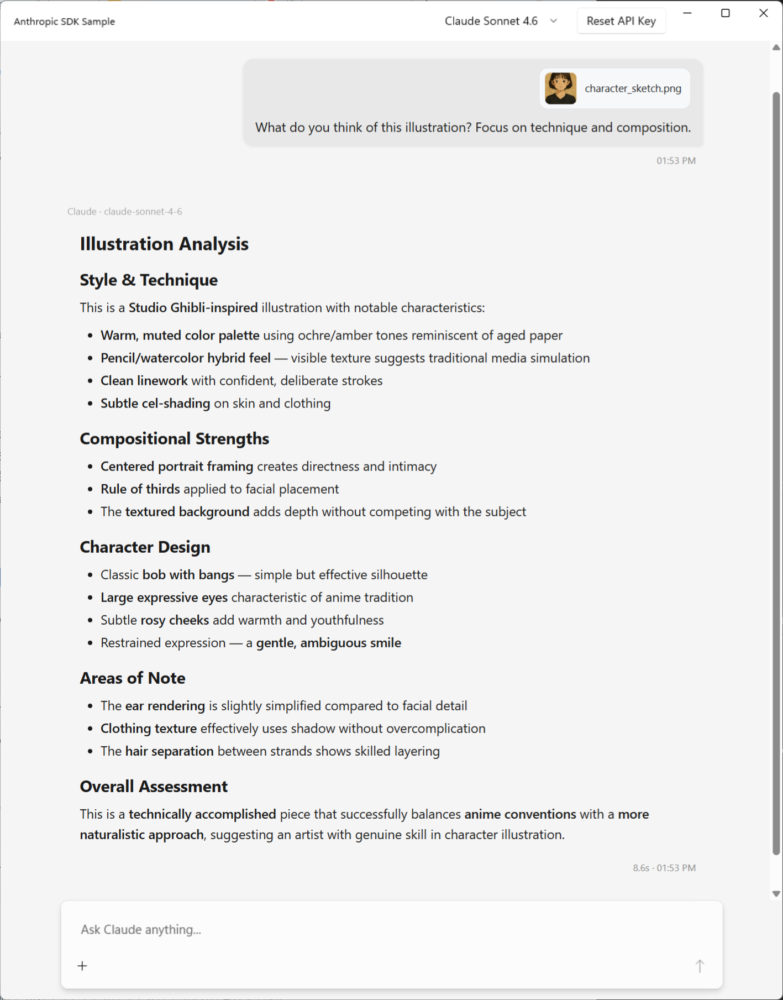

# AnthropicSdkSample

A minimal sample app that streams directly from the Anthropic C# SDK into a `ChatPanel`.
Demonstrates real-world usage of the `FieldCure.AssistStudio.Controls.WinUI.Anthropic` package.



## Prerequisites

- Visual Studio 2022 17.12+
- .NET 9.0 SDK
- Windows App SDK 1.7+
- Anthropic API Key ([console.anthropic.com](https://console.anthropic.com/))

## Scope

This sample focuses on the **core streaming integration** — showing how to bridge the
Anthropic C# SDK to `ChatPanel` with minimal code. It is intentionally not a full-featured
chat application.

**What this sample demonstrates:**

- Text streaming via `StreamAnthropicAsync` → live `ChatPanel` rendering
- Thinking block streaming (`ThinkingDelta` mapping)
- Image and text file attachments (vision + inline text)
- Multi-turn conversations (`GetConversationAsAnthropicMessages` converts full history)
- Runtime model switching (Opus 4.6 / Sonnet 4.6 / Haiku 4.5)
- Stop button — cancels the active stream mid-response via `CancellationToken`
- Secure API key storage via Windows Credential Manager (DPAPI)
- Markdown, code highlighting, and KaTeX rendering (WebView2-based)

**What this sample does not include:**

- System prompts (no UI — can be enabled by one line in `OnUserMessageSubmitted`)
- Tool calling (out of scope for v1.0; `AssistantTurnHandle.AppendToolResultAsync` not exposed)
- Conversation persistence (history is lost on app close)
- Auto-title / auto-summarize (requires `UtilityProvider` configuration)
- PDF / DOCX attachments (converter currently handles images and text files only)
- Thinking content round-trip (received OK, but dropped when sent back in history —
  signature preservation requires a `ChatMessage` extension)
- Conversation branching / edit-retry (routes through the internal provider path,
  which is disabled in this sample)

These omissions are deliberate — each would require either additional public API on
`ChatPanel` or a dedicated design. For a full-featured implementation, see the main
AssistStudio app.

## API Key Setup

On first launch, the app prompts for your API key via a dialog.
The key is stored securely in **Windows Credential Manager** (PasswordVault, DPAPI-encrypted)
and loaded automatically on subsequent launches.

To change the saved key, click the **Reset API Key** button in the title bar.

## Adding a System Prompt

The simplest extension — add one line in `OnUserMessageSubmitted` before the SDK call:

```csharp
var stream = _client.Messages.CreateStreaming(new MessageCreateParams
{
    Model = _currentModelId,
    System = new MessageCreateParamsSystem("You are a helpful assistant."),
    Messages = conv.Messages,
    MaxTokens = 4096,
});
```

## Run

Set `AnthropicSdkSample` as the startup project in VS and press F5.

Or from the command line:

```powershell
dotnet run --project samples/AnthropicSdkSample -p:Platform=x64
```

## How It Works

```
First launch
    → ContentDialog prompts for API key
    → Key saved to PasswordVault (DPAPI-encrypted)

User types a message
    → ChatPanel.UserMessageSubmitted fires
    → BeginAnthropicTurn() creates the assistant message bubble
    → GetConversationAsAnthropicMessages() converts history to SDK format
    → client.Messages.CreateStreaming() calls the Anthropic API
    → handle.StreamAnthropicAsync() maps SDK events → ChatPanel rendering
    → handle.DisposeAsync() finalizes the message
```

The entire integration lives in a single method: `OnUserMessageSubmitted` in `MainWindow.xaml.cs`.
