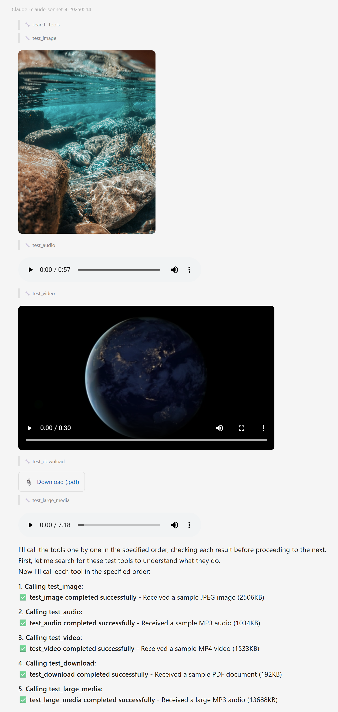

# TestMcpServer

A stdio MCP server for testing AssistStudio's multimedia tool result rendering pipeline. Returns various content block types (image, audio, video, embedded resource) using real sample media files.

## Purpose

- Verify `ImageContentBlock`, `AudioContentBlock`, and `EmbeddedResourceBlock` rendering
- Test inline media players (`<audio>`, `<video>`) and download links
- Test large media temp file conversion (>10MB data URI to `file://` URI)
- Test `search_tools` dynamic promotion (tools discovered at runtime)
- Test WebView2 link policy (`file://`, `https://` navigation)

## Tools

| Tool | Content Block | What It Tests |
|---|---|---|
| `test_image` | `ImageContentBlock` (JPEG) | Inline image, toolbar (save/copy/expand) |
| `test_audio` | `AudioContentBlock` (MP3) | `<audio controls>` inline player |
| `test_video` | `EmbeddedResourceBlock` (MP4 blob) | `<video controls>` inline player |
| `test_download` | `EmbeddedResourceBlock` (PDF blob) | Download link with FileSavePicker |
| `test_large_media` | `AudioContentBlock` (14MB MP3) | Temp file conversion, virtual host playback |

## Sample Files

Located in `Samples/` directory (tracked in git):

- `sample.jpg` (2.5MB) - underwater photograph
- `sample.mp3` (1.1MB) - short audio clip
- `sample.mp4` (1.5MB) - short video clip
- `sample.pdf` (193KB) - PDF document
- `large_sample.mp3` (14MB) - long audio for temp file threshold testing

## Setup

### Build

```bash
dotnet build tests/TestMcpServer/TestMcpServer.csproj
```

### Register in AssistStudio

1. Open AssistStudio Settings > MCP Servers > Add Server
2. Fill in:
   - **Server Name**: `TestMcpServer`
   - **Description**: `Test media content blocks (image, audio, video, download)`
   - **Transport**: `Stdio`
   - **Command**: `dotnet`
   - **Arguments**: `run --project D:\Codes\fieldcure-assiststudio\tests\TestMcpServer`
3. Click OK

Alternatively, use an absolute path to the built executable:
- **Command**: `D:\Codes\fieldcure-assiststudio\tests\TestMcpServer\bin\Debug\net8.0\TestMcpServer.exe`
- **Arguments**: *(leave empty)*

### Enable

In the chat input area, click the tool icon and check **TestMcpServer** to enable its tools.

## Test Prompt

Paste the following prompt in a new chat tab to run all tests sequentially:

```
Call the following tools one by one in order. Check each result before calling the next tool.

1. test_image
2. test_audio
3. test_video
4. test_download
5. test_large_media

After all tool calls are done, include a markdown link at the end: [Google](https://www.google.com)
```

### Expected Results



1. **test_image** - JPEG image displayed inline with hover toolbar (save/copy/expand)
2. **test_audio** - `<audio>` player with playback controls, duration shown
3. **test_video** - `<video>` player with playback and fullscreen controls
4. **test_download** - "Download (.pdf)" link, click triggers FileSavePicker
5. **test_large_media** - `<audio>` player; file saved to `%LocalAppData%\FieldCure\AssistStudio\temp\` and served via virtual host
6. **Google link** - Clickable, opens in default browser

## Dependencies

- .NET 8.0
- `ModelContextProtocol` 1.2.0
- `Microsoft.Extensions.Hosting` 9.x
